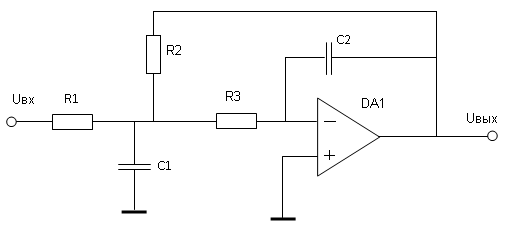
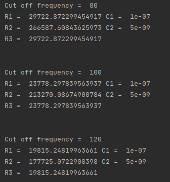
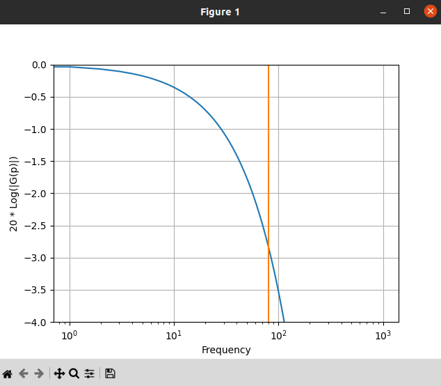
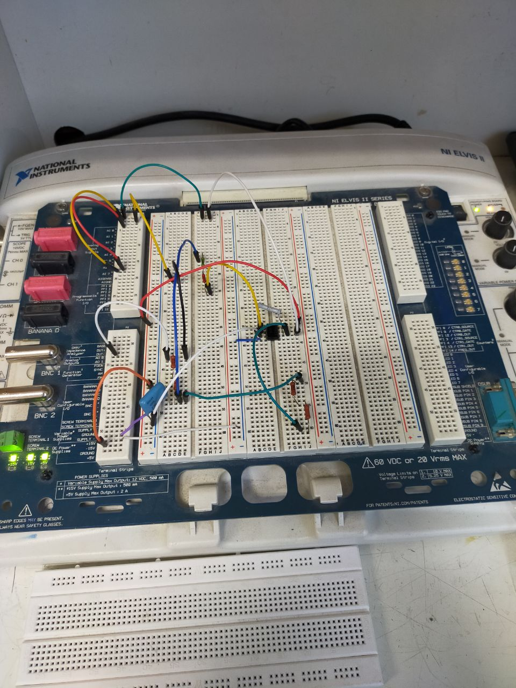
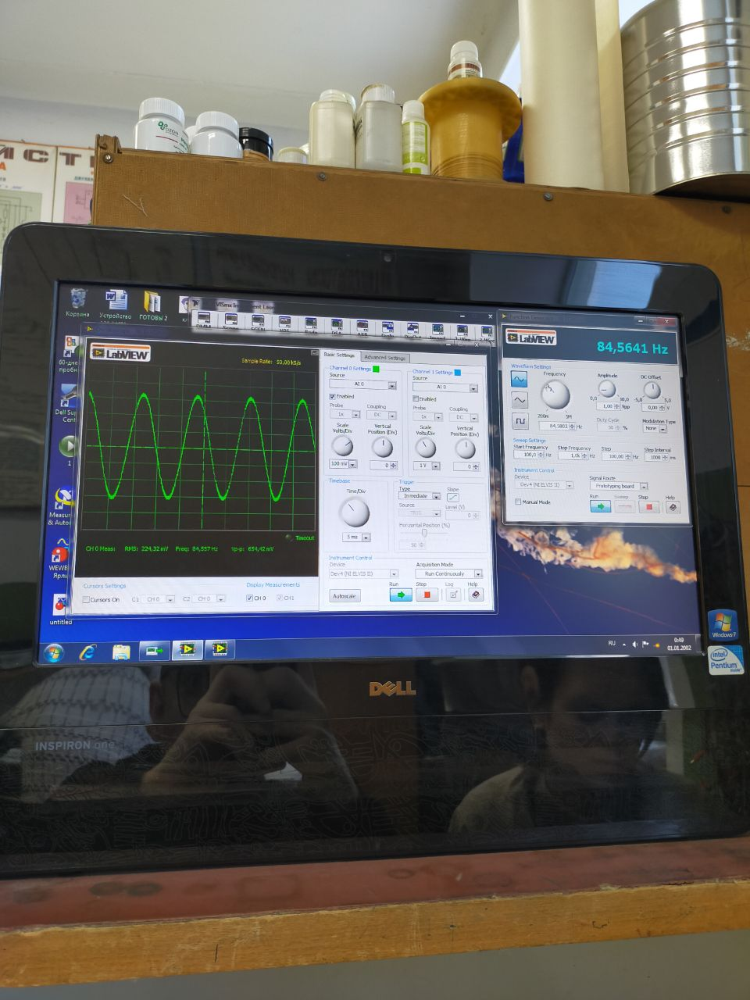
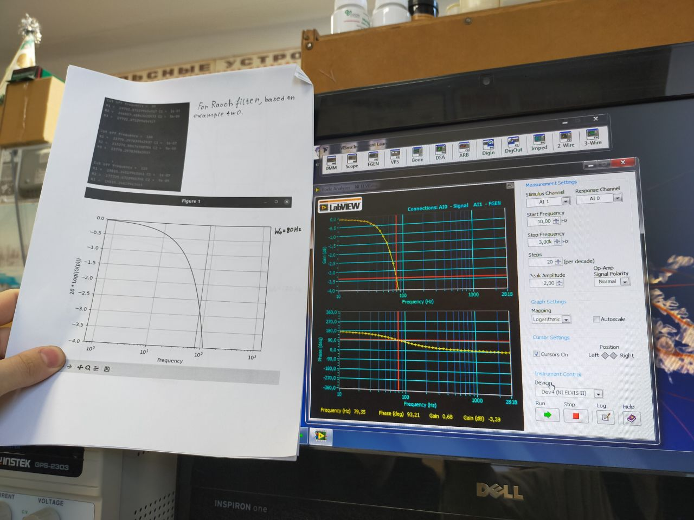

# Rauch_Filter
Research project on the development and configuration of a low-frequency Rauch filter

Goal: calculate and make low-frequency Rauch filter.

Second-order filter cant contain only passive elements. Usualy, used operational amplifier.

Then the transient characteristic we can calculate as: 

$$ G(p) = \frac{(-1)} {((\frac{R1}{R3} + (\frac{R1 * R2}{R3}) * C2 * p) + ((R1 + R2) * C2 * p) + (R1 * R2 * C1 * C2 * p^2)))}$$

Elements we can calculate as:

$$ C1 = C_{input} $$

$$ C2 = C1 * 0.05 $$

$$ R3 = \frac{\alpha * H + \sqrt{\alpha^2 * H^2 - 4(1 + H)H * k}}{2 * W_{0} * C * H * k} $$

$$ R2 = \frac{1}{W^2_{0} * R_{1} * k} $$

$$ R1 = \frac{R3}{H}$$

There: 
$$C_{input} is \ the \ specified \ capacity\ value,\ for\ units\ of\ hertz\ 0.1 * 10^-9F$$ 

H - is transmission ratio

W0 - is cutoff frequency

alpha - is the coefficient determining the type of frequency response

For elements calculation a python program has been writen, also this program can plot amplitude-frequency response. (Look at main.py). This is results of elements calculation 

There amplitude-frequency response of filter from calculated elements

To check the correctness of calculations, the real Rauch filter has been built. 

Used elements R1 = 30kOhm R2 = 268kOhm R3 = 30kOhm C1 = 0.1mcF C2 = 470nF as you can see, we cant install the same elemets as in calculating, because there are no resistors on 29722 Ohm and onther accuracy values.

Here you can see some noise caused by the rattling of the contacts and the errors of the op-amp

With the help of LabView tools, the amplitude-frequency and phase-frequency characteristics were constructed. As you can see, the results of modeling the operation of the filter coincide with real measurements within the margin of error

